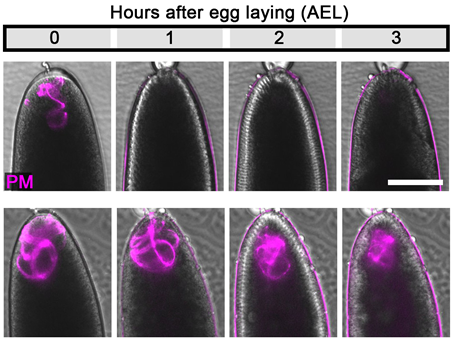
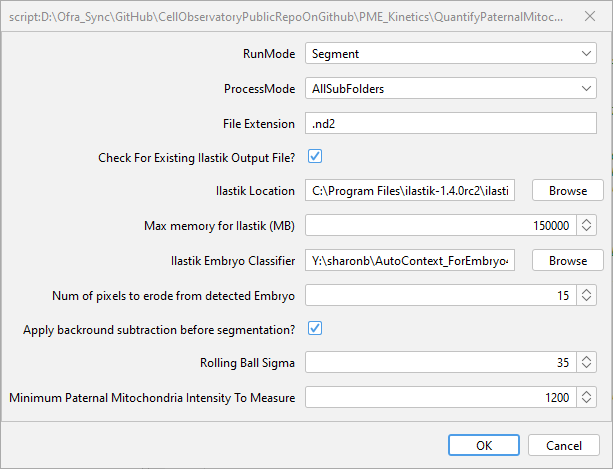

# Evaluating paternal mitochondrial elimination kinetics in Drosophila embryos

## Overview

Measure paternal mitochondria (PM) fluorescence intensity in early Drosophila embryos, following 3 hours after egg laying. 
Two channel 2D images were acquired for each embryo: A bright field (BF) channel and a fluorescent channel of the 
(MTS)tdTomato (red-PM). Embryos that failed to complete cellularization were omitted from the analysis. 
Each image includes one or two embryos.

This macro was used in:     

 <strong> Egg MVBs elicit an LC3-associated phagocytosis-like pathway to degrade paternal mitochondria after fertilization </strong>    

	

 <strong>Sharon Ben-Hur, Shoshana Sernik, Sara Afar, Alina Kolpakova, Yoav Politi, Liron Gal, Anat Florentin, Ofra Golani, Ehud Sivan, Nili Dezorella, David Morgenstern, Shmuel Pietrokovski, Eyal Schejter, Keren Yacobi-Sharon, Eli Arama </strong>   
	

Software package: Fiji (ImageJ)
Workflow language: ImageJ macro
     
## Workflow

Go over the folder of embryo images, for each file
- Segment Embryo from brightfield channel using Ilastik autocontext workflow
	 + Run Ilastik Autocontext pixel classifier - it is assumed that the embryo class is 2 and the background is 1
 	 + erode labels by  erodeEmbryoPixels (defualt 3)  to avoid artifacts on the edges of the embryo 
	 + remove segments smaller than  MinSizePixels (default 5000) 
 	 + Add the embryos regions to the Rois Manager

- Quantify flourescent signal
	 + optionally (default, depends on applyRollingBallBGS) apply Rolling ball background subtraction with sigma = rollingBallSigma
	 + segment Mito-positive regions by applying fixed threshold (MinIntensityToMeasure) to the florescent signal
	 + for each embryo quantify total/mean signal in whole embryo / Mito-Positive region / Mito negative region, calculate MeanMitoPositive-MeanMitoNegative
	 
- Save results 
	 + Create Quality control images
	 + save Rois - to enable manual correction of embryo regions with Update mode
	 + save results in a table with one line for each embryo in each image

You can use previous ilastik clasification by checking "CheckForExistingIlastikOutputFile". 
This is useful if you want to try different macro parameters without running ilastik again (as it takes most of the runtime)
  
If the embryo segmentation is not good enouh for some of the embryos, 
you can use manually correct the embryo segmentation (see below) and and run the macro in *update* mode. 
This will use the manually corrected segmentation if this is available and the original automatic segmentation for all other embryos

## Installation and Dependencies

 1. Install Fiji:  https://imagej.net/software/fiji/
    We used the Windows-64 version, but it should work withe other Fiji versions
     
 2. Install Fiji Ilastik plugin: 

 To install it, open Fiji and within Fiji :
 - Help=>Update
 - Click “Manage Update sites”
 - Check “ilastik”
 - Click “Close”
 - Click “Apply changes”

3. Install Ilastik from https://www.ilastik.org/ and follow installation instructions.
   We trained the classifier with version 1.3.3post3, we tested also that it can be applied with version 1.4.0

4. Download the Sample data provided here to test that the macro is working
   
5. Download AutoContext_ForEmbryo4.zip file and unzip it. This is the ilastik classifier we trained for embryo segmentation.
   select its location, when asked about *ilastik Embryo classifier* (see below)  
   For your own data, it is advised that you train your own classifier. see ilastik documentation for further instructions. 

## Sample data
Sample files are provided for testing the macro, togetehr with the related Results files (within Results subfolder of each sample data folder) and the ilastik classifier used for the analysis (AutoContext_ForEmbryo4.zip  unzip the file and use AutoContext_ForEmbryo4.ilp).

## Usage Instructions

Go over the folder of embryo images and check each picture at all 4 time points. 
If a picture is good, rename all 4 images with the same name: “1+2+3 use 2+3”. 
This should be the correct number of the embryos (each image will only have a few embryos from the entire experiment). Not every embryo in each image will be usable. For example, if the embryo does not cellularize by the 3 hour image or if there is no visible mitochondria. Because of this, indicate which embryos in the image will actually be used for the final graphs. It is important to write this down, because the program will run on every embryo in the image and you will need to remove the unsuitable embryos from the final excel sheets. 
It is important to note that the program should only recognize whole embryos. This means that if in some of your images, there are parts of an embryo from the previous or next frame/image, do not include these in your numbering. 
Move all of the numbered images that you want to keep to their own folder. There should be a folder for each time point (0,1,2, and 3). 
Once the selected images are in the new folder, run the program on each folder. 
To run the program, drag the file: “QuantifyPaternalMitochondriaInEmbryo2D.ijm” into ImageJ and press “Run”.
You will be presented with the following window:

	

- Set *runMode* to be *Segment* 
  
- There are two modes of operation controlled by *processMode* parameter:
  + *singleFile*    - prompt the user to select a single TJ file to process.
  + *wholeFolder*   - prompt the user to select a folder of images, and process all images
  + *AllSubfolders* - prompt the user to select a folder with subfoldrs of images, and process all images
  
- Choos ethe proper file extension. For Nikin images, the file extension should be .d2 
- select ilastik location (ilastik.exe file from the folder where you installed ilastik) and Ilastik classifier (for example AutoContext_ForEmbryo4.ilp) 
- set parameters - see description above
- click *OK*
- Once the program is done running, use the quality-control output overlay files to careful inspect of results of **all** images, especially pay attention to PME signal segmentation and make sure the ROI for each embryo that you want to use is correct.
- Manually correct embryos Rois if needed (see below) and Save the corrected Rois into FN_RoiSet_Manual.zip
- if any manual correction was done, run the macro again, set *runMode* to be *Update* , 
  This will use the manually corrected segmentation if this is available and the original automatic segmentation for all other embryos
  and will recalculate PME signal using the given segmentation
  	o	You can save the corrected ROI files in the same folder as the other images being used. The program will know to use the “_Manual” for each image if it is available. If there is no such file for a particular image, it will run the program again on the original image
	o	You will have an Excel sheet of the original results before manual correction. You will also have another excel sheet after running the program again with the RunMode set to Update. The embryos that did not have their ROIs changed will have the same results in both of these Excel sheets. 
- After running the program, a new subfolder will appear in each folder that you ran called “Results”. Please see the “Output” section above for details on the contents of this folder.

##  Manual Correction
The above automatic process segment correctly most of the embryos. 
Further manual correction is supported by switching from *Segment* Mode to *Update* Mode.   

### To start manual correction: 
- Open the original image (FN). This is the (nd2) file from the parent image folder, and not from the Results subfolder.
- make sure there is no RoiManager open in Fiji. The program will open a new RoiManager window for each image when you open it.
- drag-and-drop the "FN_EmbryosRoiSet.zip" into Fiji main window. The extension will be .roi if is only one embryo in the image.
- This will show the ROI in magenta on each embryo in the original image that you opened. Remember that the ROI does not extend to the edge of each embryo, rather it begins *erodeEmbryoPixels* pixels in from the edge. If you correct the ROI to extend to the edge of the embryo, the program will use your new manually designated ROI, so do not manually extend the ROI to the edge of the embryo. 
- in RoiManager: make sure that "Show All" is selected. Ususaly it is more conveinient to unselect Labels 
  
### Select A ROI
- You can select a ROI from the ROIManager or with long click inside a embryo to select its outer ROI (with the Hand-Tool selected in Fiji main window), 
  this will highlight the (outer) ROI in the RoiManager, the matching inner Roi is just above it
   
### Delete falsely detected objects
- select a ROI
- click "Delete" to delete a ROI. 
  
### Fix segmentation error 
- select a ROI
- you can update it by any ROI tool, for example using the brush tool. Right click on the box in the menu bar that is second from the left and select: “Selection Brush Tool”. (hiding the Rois from the RoiManager by deselecting "Show All", may be convnient at this stage) 
- When using the brush tool, hold down the *Shift* key to add region to the existing selection. Hold down the *Alt* key to subract from the existing selection
- click "Update" in the ROI manager to save the new ROI you created.
  
- otherwise you can delete the ROI (see above) and draw another one instead (see below)
  
### Add non-detected embryo
- You can draw a ROI using one of the drawing tools 
- an alternative can be using the Wand tool , you'll need to set the Wand tool tolerance first by double clicking on the wand tool icon. 
  see also: https://imagej.nih.gov/ij/docs/tools.html
- click 't' from the keyboard or "Add" from RoiManger to add it to the RoiManager 
  
### Save ROIs
When done with all corrections make sure to 
- from the RoiManager, click "Deselect" 
- from the RoiManager, click "More" and then "Save" , save the updated file into a file named as the original Roi file with suffix "_Manual":  
  "FN_EmbryosRoiSet_Manual.zip", using correct file name is crucial

## Output

For each input image FN, the following output files are saved in ResultsSubFolder under the input folder
- FN_Ch1Overlay.tif 	- the original brightfield channel with overlay of the segmented Embryos in magenta (EmbryoColor)
- FN_Ch2_AboveTh.tif - the flourescnce channel after background subtraction and where all pixels below MinIntensityToMeasureare set to 0  
- FN_Ch2Overlay.tif 	- the original flourescnce channel with overlay of the segmented Embryos in magenta (EmbryoColor), and PME signal above threshold in yellow (IntensityColor)  
- FN_DetailedResults.xls - an Excel file with one line for each embryo in the image file. Embryos are numbered according to their position along the y axis of the photo, not along the x. So, if you labeled the left most embryo as 1 in your file name, it might not be 1 in the Excel file. To check which embryo is which, open the file: FN_Ch1Overlay.tif or FN_Ch1Overlay_Manual.tif (if you corrected the ROI for any of the embryos in this image). In this image, each embryo is numbered and the numbering corresponds to the numbering in the excel sheet.  
- FN_EmbryosRoiSet.zip   - the embryo segments used for measurements - this file can be used for manually update 
- FN__Segmentation Stage 2.h5  - the Crystal Domain segments used for measurements

Overlay colors can be controled by EmbryoColor and IntensityColor

AllDetailedResults_test.xls - a combined results table for all the embryos in all the images. It has one line for each embryo in each image file - for each image folder
QuantifyPaternalMitochondriaInEmbryo2DParameters.txt - This file record all the script parameters used during the latest run. If you want to test the script with different parameters, you can rename the Results folder to save the results for each parameter settings.

